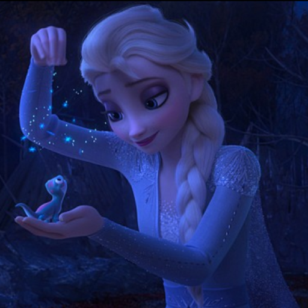
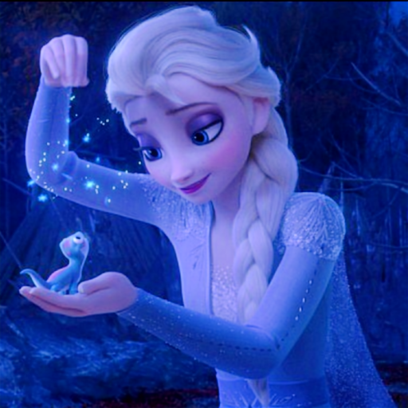
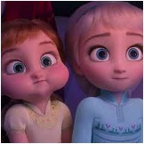
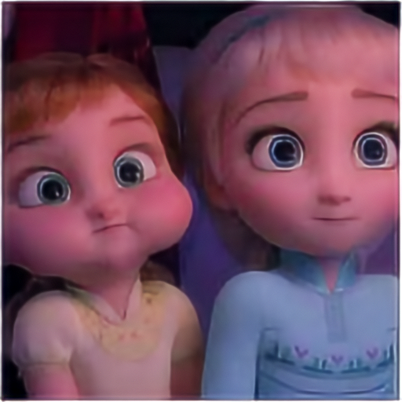
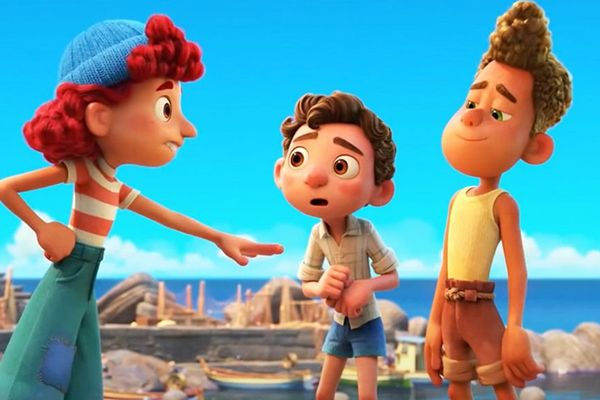
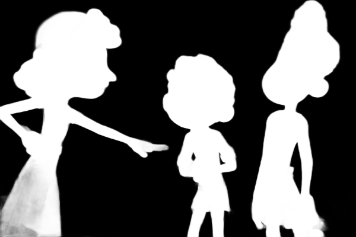

# ONNX-Models
Converted ONNX Model Zoo.

ONNX(Open Neural Network Exhange) is an open format built to represent machine learning models.

# How to use

Please review the model zoo, and if you locate the desired ONNX model, download it from the provided Google Drive link and integrate it into your project.

# Image Restoration

### MIRNetv2
- constrast enhancement

      
- super resolution

     
     

| Name | Size | Output | Original Project | License  | Year | Conversion Script | onnx  | onnx quantization |
| ------------- | ------------- | ------------- | ------------- |------------- |------------- | -- | -- | -- |
| MIRNetv2ContrastEnhancement   |   256 x 256  |   Image(RGB 256x256)    |   [swz30/MIRNetv2](https://github.com/swz30/MIRNetv2)  | [ACADEMIC PUBLIC LICENSE](https://github.com/swz30/MIRNetv2/blob/main/LICENSE.md)  |2022| [jupyter notebook](./scripts/mirnetv2_onnx.ipynb) | [onnx model](./onnx_models/mirnetv2.onnx) | [onnx 양자화 model](./onnx_models/mirntev2_quant.onnx) |
| MIRNetv2_super_resolution   |   512 x 512  |   Image(RGB 512x512)    |   [swz30/MIRNetv2](https://github.com/swz30/MIRNetv2)  | [ACADEMIC PUBLIC LICENSE](https://github.com/swz30/MIRNetv2/blob/main/LICENSE.md)  |2022| [jupyter notebook](./scripts/mirnetv2_onnx.ipynb) | [onnx model](./onnx_models/mirnetv2/mirnetv2_sp.onnx) | [onnx 양자화 model](./onnx_models/mirnetv2/mirnetv2_sp_quant.onnx) |

### IS-Net
- Highly Accurate Dichotomous Image Segmentation

     
     

|   Name    |   Input Size    | Original Project    |   License | Year  | Conversion Scipt  |
|-|-|-|-|-|-|
|   [IS-Net](https://drive.google.com/drive/folders/1o5ph5eXhY0s7SCDJSSQNYa6WNOMH9PP8?usp=drive_link)  |  1024 x 1024 |    [xuebinqin/DIS](https://github.com/xuebinqin/DIS) | [Apache](https://github.com/xuebinqin/DIS/blob/main/LICENSE.md) |   2022    |  [jupyter notebook](./scripts/conversion_isnet.ipynb)|

# Thanks

Images were taken from Disney images.  
My project was inspired by [CoreML-Models](https://github.com/john-rocky/CoreML-Models/blob/master/README.md#mirnetv2) project