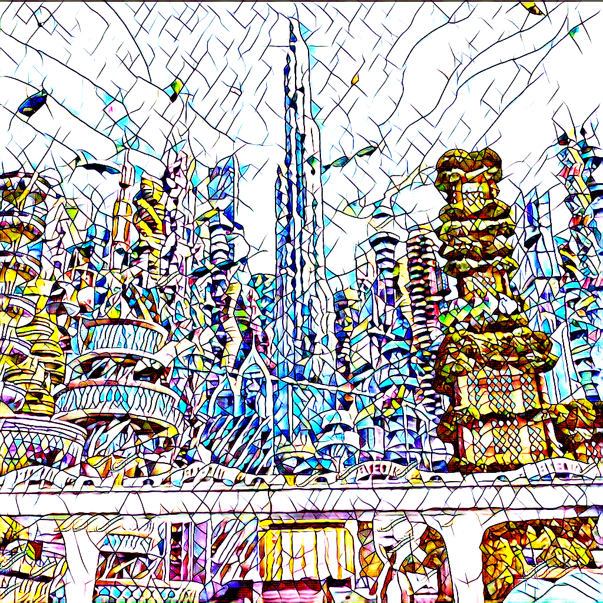
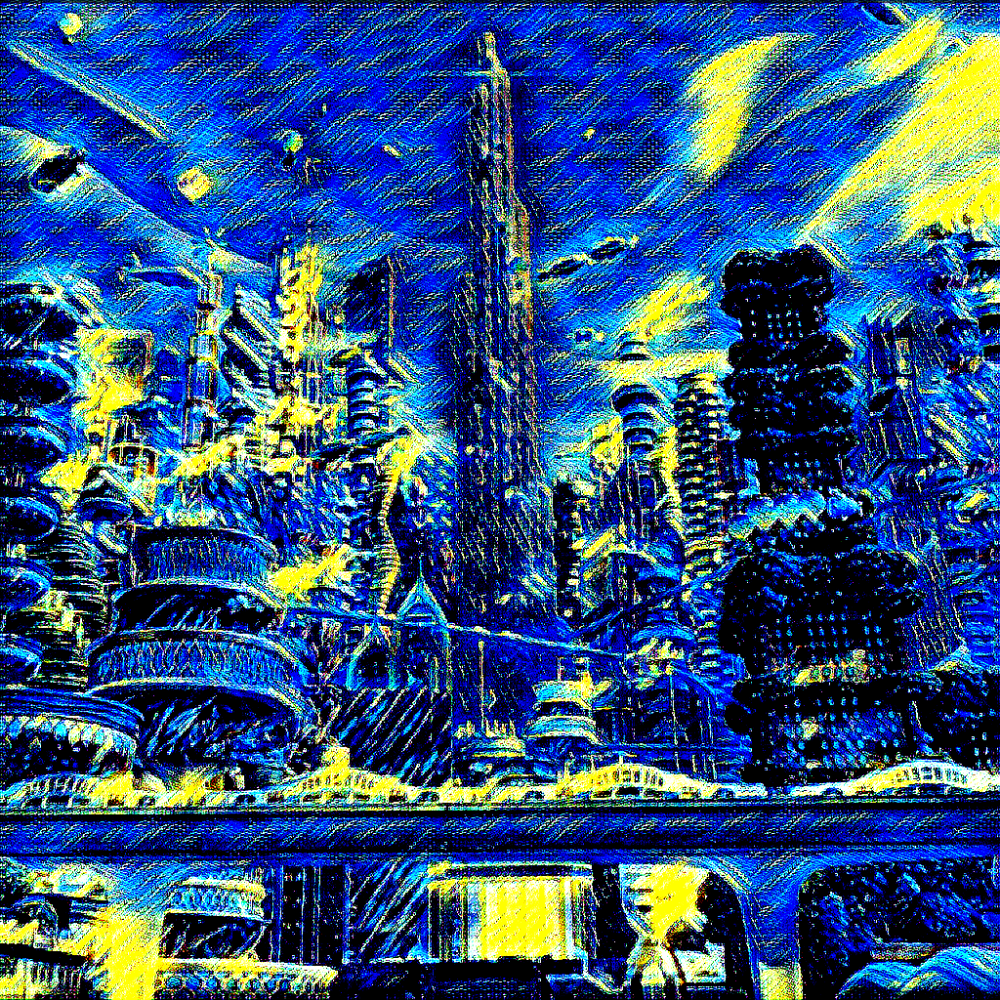
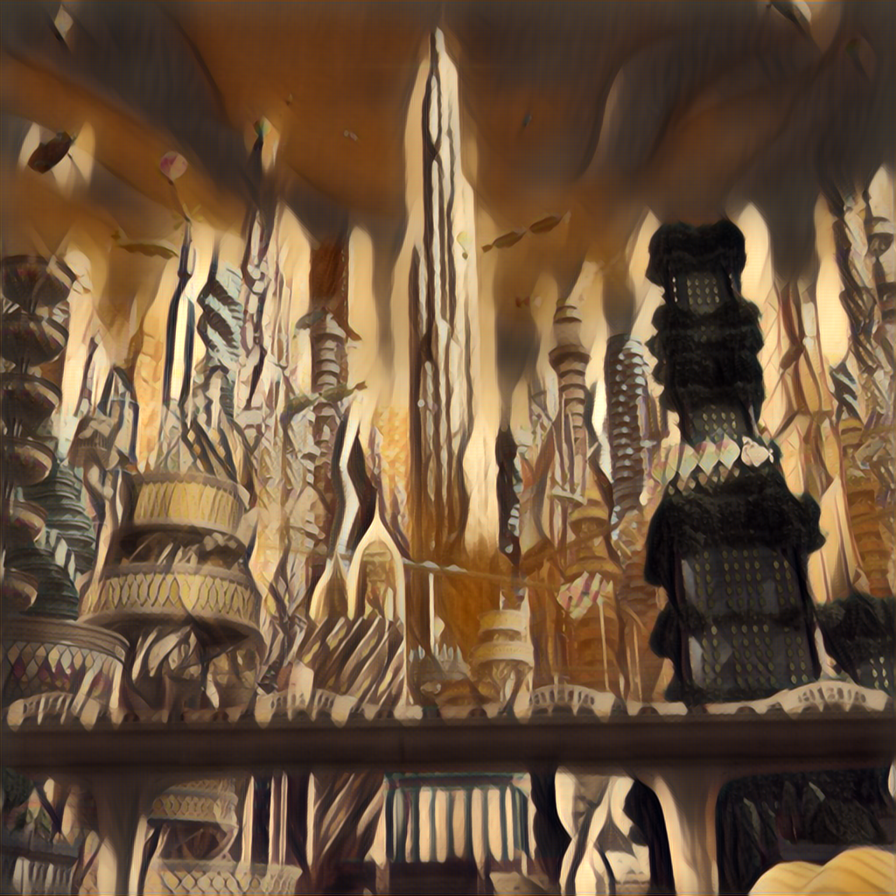

# ONNX-Models
Converted ONNX Model Zoo.

ONNX(Open Neural Network Exhange) is an open format built to represent machine learning models.

# How to use

Please review the model zoo, and if you locate the desired ONNX model, download it from the provided Google Drive link and integrate it into your project.

# Image Restoration

### MIRNetv2
- constrast enhancement

     
     
- super resolution

     
     

| Name | Size | Output | Original Project | License  | Year | Conversion Script | onnx  | onnx quantization |
| ------------- | ------------- | ------------- | ------------- |------------- |------------- | -- | -- | -- |
| MIRNetv2ContrastEnhancement   |   256 x 256  |   Image(RGB 256x256)    |   [swz30/MIRNetv2](https://github.com/swz30/MIRNetv2)  | [ACADEMIC PUBLIC LICENSE](https://github.com/swz30/MIRNetv2/blob/main/LICENSE.md)  |2022| [jupyter notebook](./scripts/mirnetv2_onnx.ipynb) | [onnx model](./onnx_models/mirnetv2.onnx) | [onnx 양자화 model](./onnx_models/mirntev2_quant.onnx) |
| MIRNetv2_super_resolution   |   512 x 512  |   Image(RGB 512x512)    |   [swz30/MIRNetv2](https://github.com/swz30/MIRNetv2)  | [ACADEMIC PUBLIC LICENSE](https://github.com/swz30/MIRNetv2/blob/main/LICENSE.md)  |2022| [jupyter notebook](./scripts/mirnetv2_onnx.ipynb) | [onnx model](./onnx_models/mirnetv2/mirnetv2_sp.onnx) | [onnx 양자화 model](./onnx_models/mirnetv2/mirnetv2_sp_quant.onnx) |

# Image Segmentation

### IS-Net
- Highly Accurate Dichotomous Image Segmentation

     
     

|   Name    |   Input Size    | Original Project    |   License | Year  | Conversion Scipt  |
|-|-|-|-|-|-|
|   [IS-Net](https://drive.google.com/drive/folders/1o5ph5eXhY0s7SCDJSSQNYa6WNOMH9PP8?usp=sharing)  |  1024 x 1024 |    [xuebinqin/DIS](https://github.com/xuebinqin/DIS) | [Apache](https://github.com/xuebinqin/DIS/blob/main/LICENSE.md) |   2022    |  [jupyter notebook](./projects/isnet/conversion_isnet.ipynb)|

### BisNet v1 & v2
- Image Segmentation

     
     
- Face parsing

     
     

|   Name    |   Input Size    | Original Project    |   License | Year  | Conversion Scipt  |
|-|-|-|-|-|-|
|   [BiSeNet](https://drive.google.com/drive/folders/1b1FAQpIKLucqdLd8X4XCSI-5mT4hcNR5?usp=sharing)  |  512 x 512 |    [CoinCheung/BiSeNet](https://github.com/CoinCheung/BiSeNet) | [MIT](https://github.com/CoinCheung/BiSeNet/blob/master/LICENSE) |   2018(v1) / 2020(v2)    |  [jupyter notebook](./projects/bisenet/conversion_bisenet.ipynb)|
|   [face-parsing](https://drive.google.com/drive/folders/117I6WXaFmVx_6v-GphBVBIMXg2zF-Mcm?usp=sharing)    | 512 x 512 |   [zllrunning/face-parsing.PyTorch](https://github.com/zllrunning/face-parsing.PyTorch?tab=readme-ov-file)    | [MIT](https://github.com/zllrunning/face-parsing.PyTorch?tab=MIT-1-ov-file#readme)    | 2019  | [jupyter notebook](./projects/face-parsing/conversion_faceparsing.ipynb)

# Image2Image

### Anime2Sketch
- A sketch extractor for illustration, anime art, manga

     
     

|   Name    |   Input Size    | Original Project    |   License | Year  | Conversion Scipt  |
|-|-|-|-|-|-|
|   [Anime2Sketch](https://drive.google.com/drive/folders/13q7haNxCEYPb11PLwShQj7_kR2-JuiSB?usp=sharing)  |  512 x 512 |    [Mukosame/Anime2Sketch](https://github.com/Mukosame/Anime2Sketch) | [MIT](http://github.com/Mukosame/Anime2Sketch#MIT-1-ov-file) |   2021    |  [jupyter notebook](./projects/Anime2Sketch/conversion.ipynb)|

### AnimeGAN2Face_Paint_512_v2
- Face Portrait v1

     
     

|   Name    |   Input Size    | Original Project    |   License | Year  | Conversion Scipt  |
|-|-|-|-|-|-|
|   [AnimeGANv2](https://drive.google.com/drive/folders/1ty6x_SVls_xQCWiworLdKRhGBtQApO4B?usp=sharing)  |  512 x 512 |    [bryandlee/animegan2-pytorch](https://github.com/CoinCheung/BiSeNet) | [MIT](https://github.com/bryandlee/animegan2-pytorch/blob/main/LICENSE) |   2021    |  [jupyter notebook](./projects/animeganv2/conversion.ipynb)|

### Fast Neural Style Transfer
- Style Transfer - cuphead, mosaic, starry night

     
    
     
    
     
    
     
    
     

|   Name    |   Input Size    | Original Project    |   License | Year  | Conversion Scipt  |
|-|-|-|-|-|-|
|   [fast-neural-style-transfer-cuphead](https://drive.google.com/drive/folders/1ty6x_SVls_xQCWiworLdKRhGBtQApO4B?usp=sharing)  |  1024 x 1024 |    [eriklindernoren/Fast-Neural-Style-Transfer](https://github.com/eriklindernoren/Fast-Neural-Style-Transfer?tab=readme-ov-file) | [MIT](https://github.com/eriklindernoren/Fast-Neural-Style-Transfer/blob/master/LICENSE) |   2019    |  [jupyter notebook](./projects/fast-neural-style-transfer/conversion.ipynb)|
|   [fast-neural-style-transfer-mosaic](https://drive.google.com/drive/folders/1ty6x_SVls_xQCWiworLdKRhGBtQApO4B?usp=sharing)  |  1024 x 1024 |    [eriklindernoren/Fast-Neural-Style-Transfer](https://github.com/eriklindernoren/Fast-Neural-Style-Transfer?tab=readme-ov-file) | [MIT](https://github.com/eriklindernoren/Fast-Neural-Style-Transfer/blob/master/LICENSE) |   2019    |  [jupyter notebook](./projects/fast-neural-style-transfer/conversion.ipynb)|
|   [fast-neural-style-transfer-starry_night](https://drive.google.com/drive/folders/1ty6x_SVls_xQCWiworLdKRhGBtQApO4B?usp=sharing)  |  1024 x 1024 |    [eriklindernoren/Fast-Neural-Style-Transfer](https://github.com/eriklindernoren/Fast-Neural-Style-Transfer?tab=readme-ov-file) | [MIT](https://github.com/eriklindernoren/Fast-Neural-Style-Transfer/blob/master/LICENSE) |   2019    |  [jupyter notebook](./projects/fast-neural-style-transfer/conversion.ipynb)|
|   [fast-neural-style-transfer-lazy](https://drive.google.com/drive/folders/1ty6x_SVls_xQCWiworLdKRhGBtQApO4B?usp=sharing)  |  1024 x 1024 |    [rrmina/fast-neural-style-pytorch](https://github.com/rrmina/fast-neural-style-pytorch) | - |   2018    |  [jupyter notebook](./projects/fast-neural-style-transfer/conversion2.ipynb)|
|   [fast-neural-style-transfer-udnie](https://drive.google.com/drive/folders/1ty6x_SVls_xQCWiworLdKRhGBtQApO4B?usp=sharing)  |  1024 x 1024 |    [rrmina/fast-neural-style-pytorch](https://github.com/rrmina/fast-neural-style-pytorch) | - |   2018    |  [jupyter notebook](./projects/fast-neural-style-transfer/conversion2.ipynb)|
|   [fast-neural-style-transfer-wave](https://drive.google.com/drive/folders/1ty6x_SVls_xQCWiworLdKRhGBtQApO4B?usp=sharing)  |  1024 x 1024 |    [rrmina/fast-neural-style-pytorch](https://github.com/rrmina/fast-neural-style-pytorch) | - |   2018    |  [jupyter notebook](./projects/fast-neural-style-transfer/conversion2.ipynb)|
|   [fast-neural-style-transfer-tokyo_ghoul](https://drive.google.com/drive/folders/1ty6x_SVls_xQCWiworLdKRhGBtQApO4B?usp=sharing)  |  1024 x 1024 |    [rrmina/fast-neural-style-pytorch](https://github.com/rrmina/fast-neural-style-pytorch) | - |   2018    |  [jupyter notebook](./projects/fast-neural-style-transfer/conversion2.ipynb)|
|   [fast-neural-style-transfer-bayanihan](https://drive.google.com/drive/folders/1ty6x_SVls_xQCWiworLdKRhGBtQApO4B?usp=sharing)  |  1024 x 1024 |    [rrmina/fast-neural-style-pytorch](https://github.com/rrmina/fast-neural-style-pytorch) | - |   2018    |  [jupyter notebook](./projects/fast-neural-style-transfer/conversion2.ipynb)|

# Thanks

Images were taken from Disney images.  
My project was inspired by [CoreML-Models](https://github.com/john-rocky/CoreML-Models/blob/master/README.md#mirnetv2) project.  
You can contact me > noseungha164@gmail.com
